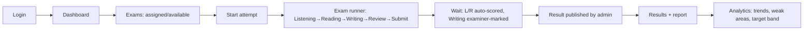
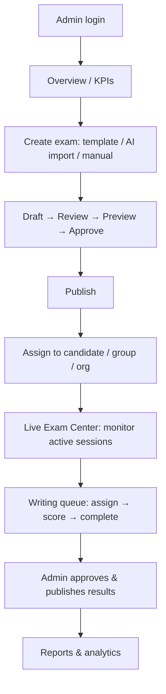
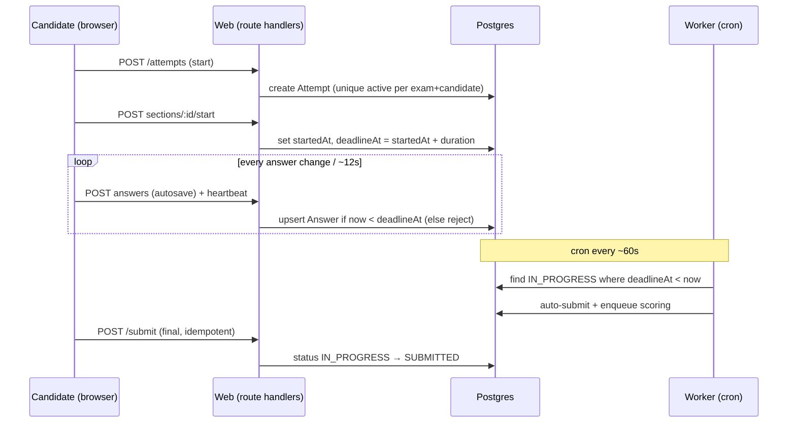
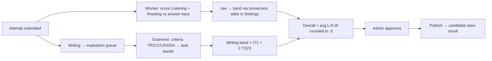

# 02 · Flows & Data-Flow Diagrams

## Authentication flow

```mermaid
flowchart TD
  A[Visitor] --> B[/register/]
  B --> C[Verify email]
  C --> D[/login/ rate-limited]
  D -->|Argon2id verify| E[Issue httpOnly Secure cookie session + role]
  E --> F{role}
  F -->|ADMIN / SUPER_ADMIN / EXAMINER| G[/admin/]
  F -->|CANDIDATE| H[/dashboard/]
  D -.forgot.-> I[/forgot/ → email single-use token] --> J[/reset/]
```

"Remember me" extends session max-age. Full detail in [08-security-and-auth.md](08-security-and-auth.md).

## Candidate flow



## Admin flow



## Exam attempt lifecycle (data flow)



The timer is **server-authoritative**: the client renders a countdown derived from
`deadlineAt`, but enforcement is server-side. Listening audio position is derived from
elapsed section time (play-once, survives refresh). See [13-cd-ux-spec.md](13-cd-ux-spec.md).

## Scoring & result publication (data flow)



## AI exam import (data flow)

See the dedicated diagram and stages in [07-ai-import-pipeline.md](07-ai-import-pipeline.md).
