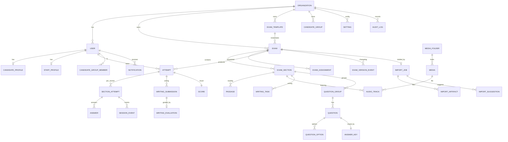

# 03 · Database ERD & Scoring

PostgreSQL via Prisma. The authoritative schema is
[`packages/db/prisma/schema.prisma`](../packages/db/prisma/schema.prisma); this document
explains it. JSONB carries type-specific question layout so all 20 IELTS question types
share one flexible-relational model. `orgId` scopes tenant data so **multi-center** is a
later flag, not a rewrite.

## ERD

## Table groups

- **Identity & tenancy** — `Organization`, `User` (role: SUPER_ADMIN/ADMIN/EXAMINER/
  CANDIDATE), `CandidateProfile`, `StaffProfile`; Auth.js: `Session`, `VerificationToken`,
  `PasswordResetToken`.
- **Authoring** — `ExamTemplate` (E1), `Exam` (+ versioning fields, E5),
  `ExamVersionEvent`, `ExamSection`.
- **Content (library, E2)** — `Passage`, `AudioTrack`, `WritingTask`, `QuestionGroup`,
  `Question`, `QuestionOption`, `AnswerKey` (server-only), `LibraryItem`. Content tables
  carry `isLibrary` / `category` / `difficulty` / `tagsJson` for reuse.
- **Groups & assignment (E3)** — `CandidateGroup`, `CandidateGroupMember`,
  `ExamAssignment` (targets CANDIDATE / GROUP / ORG).
- **Attempts & recovery (E6/E7)** — `Attempt`, `SectionAttempt` (`deadlineAt`,
  `audioStateJson`, `lastHeartbeatAt`), `Answer`, `SessionEvent`.
- **Evaluation & scoring** — `WritingSubmission`, `WritingEvaluation` (E13), `Score`.
- **Media (E9)** — `MediaFolder`, `Media` (folders, tags, versions, archive).
- **AI import** — `ImportJob`, `ImportArtifact`, `ImportSuggestion`.
- **Platform** — `Setting`, `Notification` (E10), `AuditLog`.

## Key integrity rules

- **Single active attempt** — a partial-unique index (added via raw migration) enforces at
  most one `IN_PROGRESS` attempt per `(examId, candidateId)`:
  `CREATE UNIQUE INDEX one_active_attempt ON "Attempt"("examId","candidateId") WHERE status='IN_PROGRESS';`
- **Idempotent submit** — guarded by the `AttemptStatus` state machine.
- **Frozen versions** — published `Exam` versions are immutable; edits fork a new version.
  Attempts reference the exact version taken, so historical results never shift (E5).
- **Answer keys** never leave the server.

## Scoring rules (table-driven via `Setting`, implemented in `packages/core`)

- **Listening / Reading** — raw correct (0–40) → band via a configurable conversion table
  (separate Academic vs General Reading tables; Listening shared). Matching: trim,
  case-insensitive, accepted-variant list, `MATCH` mode for set/contains.
- **Writing** — examiner scores 4 criteria (TR, CC, LR, GRA) per task → task band;
  Writing band = `(Task1 + 2·Task2) / 3` (Task 2 double-weighted, configurable).
- **Overall** — average of L, R, W rounded to nearest **0.5** (IELTS rounding: .25→.5,
  .75→next whole). 3-skill average (no Speaking). Half-bands supported.
