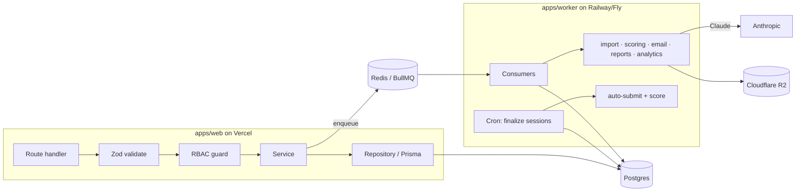

# 06 · Backend Architecture

Two runtimes share one domain core:

- **`apps/web`** — Next.js route handlers / server actions (request/response, auth, RBAC).
- **`apps/worker`** — long-running Node service (jobs, cron, AI pipeline).
- **`packages/core`** — pure domain logic (scoring, band calc, state machines, timing) with
  **no I/O**, imported by both so they never diverge.

## Layering (per request)

1. **Route handler** — parse, attach request context.
2. **Validation** — Zod schemas from `packages/validators`.
3. **RBAC guard** — role/permission check (SUPER_ADMIN/ADMIN/EXAMINER/CANDIDATE).
4. **Service** — business logic; orchestrates repositories, enqueues jobs.
5. **Repository** — Prisma data access (parameterized — SQLi-safe).

## Domain modules

`auth` · `users` · `candidates` · `groups` · `exams` · `templates` · `questionbank` ·
`attempts` (exam engine) · `scoring` · `writing-eval` · `analytics` · `media` · `import`
(AI) · `notifications` · `settings` · `audit` · `recovery`.

## Worker jobs (BullMQ queues)

| Queue | Purpose |
|---|---|
| `ai-import` | Hybrid import pipeline (parse → OCR → Claude → assemble → validate) |
| `scoring` | Objective L/R scoring + band calc on submit |
| `email` | Transactional email + notification fan-out (E10) |
| `reports` | PDF/Excel report generation |
| `analytics` | Aggregation / materialized rollups |
| `maintenance` | **Repeatable cron** — finalize expired sessions (auto-submit) |

Queue handles are created **lazily** (`getQueue`) so importing the module never opens a
Redis connection — see [`apps/worker/src/queues/index.ts`](../apps/worker/src/queues/index.ts).
The cron finalizer is what makes server-authoritative auto-submit reliable on serverless
(no live in-memory timers): see [`apps/worker/src/cron/finalize.ts`](../apps/worker/src/cron/finalize.ts).

## Server-authoritative timing (key invariant)

On section start the server stores `deadlineAt = startedAt + durationSec`. Answer writes
are rejected once `now > deadlineAt`. The client only renders a countdown derived from
`deadlineAt`. Helpers: [`packages/core/src/exam/timing.ts`](../packages/core/src/exam/timing.ts).

## Why no WebSockets

Vercel doesn't hold long-lived sockets well. Autosave = debounced HTTP POST + periodic
heartbeat; admin monitoring polls. A realtime service (Ably/Pusher) can be added later
without core changes.
