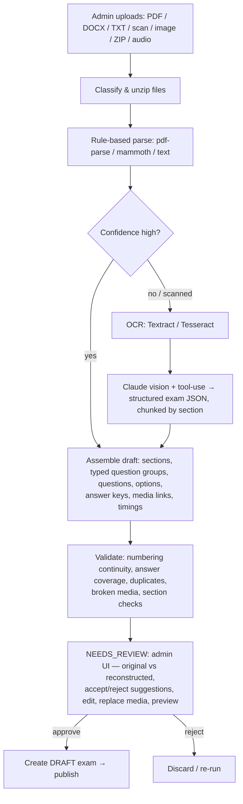

# 07 · AI-Assisted Exam Import Pipeline

**Goal:** upload IELTS mock materials → reconstruct a Computer-Delivered exam → admin
reviews/edits → approve → publish → assign. **AI never auto-publishes.** A modular
`AIProvider` interface (Claude adapter default; swappable) lives in
[`packages/ai`](../packages/ai/src); the pipeline runs in the **worker**.

## Workflow

`ImportJob.status`: `UPLOADED → PARSING → OCR → ANALYZING → STRUCTURING → VALIDATING →
NEEDS_REVIEW → APPROVED → PUBLISHED` (or `REJECTED` / `FAILED`).

## Hybrid = reliability + cost control

1. **Rule-based first** — deterministic parsing of clean PDF/DOCX/TXT; detect sections via
   headings/keywords ("Listening", "Reading Passage 1", "Writing Task 1", "Questions 1–13").
2. **Confidence scoring** — completeness heuristics (all sections? ~40 questions? answer
   key present?).
3. **AI only when needed** — low-confidence or scanned content goes to Claude (Sonnet for
   cheap passes, Opus for hard ones), with section chunking for accuracy and cost.
4. **Every AI action is logged** as an `ImportSuggestion` row so admins see and override
   exactly what AI did.

## Question-type detection

Claude returns JSON via **tool-use / structured outputs** against a strict schema, covering
the full official set (MCQ, Multiple Answer, TFNG, YNNG, all Matching variants, Sentence/
Summary/Note/Table/Flow-chart Completion, Diagram/Map/Plan Labelling, Short Answer,
Classification, Writing Task 1 & 2). Each maps to a renderer in the UI registry
([05-frontend-architecture.md](05-frontend-architecture.md)).

## AI-assisted corrections (suggestions only)

Formatting fixes · numbering corrections · missing-answer detection · broken-media links ·
section validation · duplicate-question detection · consistency checks. All surfaced as
accept/reject suggestions — admin has final authority.

## Modular provider interface

[`AIProvider`](../packages/ai/src/provider.ts): `analyzeDocument`, `detectQuestionTypes`,
`extractExam`, `suggestCorrections`. Factory `getAIProvider(config)` selects the adapter
from `AI_PROVIDER` env. Default: [`ClaudeProvider`](../packages/ai/src/providers/claude.ts)
using `AI_MODEL_PRIMARY=claude-opus-4-8` / `AI_MODEL_FAST=claude-sonnet-4-6`.

**Future AI features** (auto answer-key generation, audio-question linking, image
placement, automatic section validation, exam-template generation, smart search,
content recommendations) plug in as new provider methods — **no architectural change**.

## Admin review is mandatory

Every AI-generated exam enters `NEEDS_REVIEW`. Admins can edit questions, correct AI
mistakes, replace media, change answers, adjust formatting, preview as a candidate, and
approve or reject — before anything is published.
