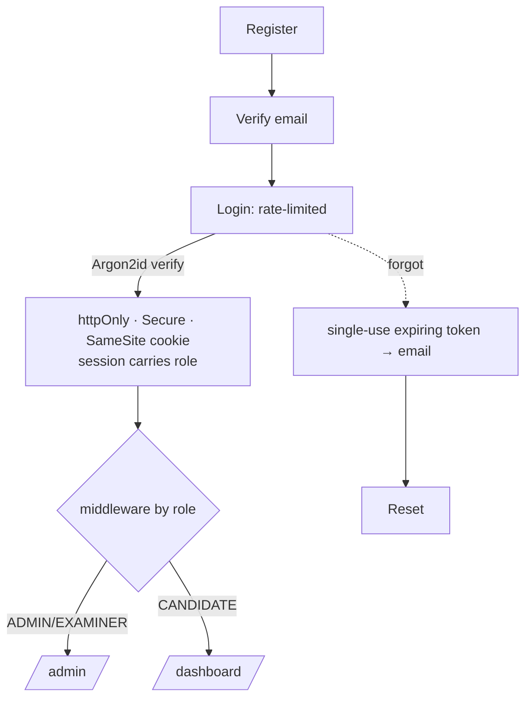

# 08 · Security Architecture, Auth & Exam Integrity

## Authentication

**Auth.js (NextAuth v5)** with a Credentials provider + Prisma adapter.

- **Password hashing** — Argon2id.
- **Sessions** — httpOnly, Secure, SameSite cookies (JWT or DB-backed). "Remember me"
  extends max-age (`SESSION_REMEMBER_ME_DAYS`).
- **Role-based redirect** — enforced in `apps/web/src/middleware.ts`.
- **Forgot/reset** — `PasswordResetToken` (hashed, single-use, expiring) emailed via Resend.

## Security controls

| Control | Implementation |
|---|---|
| Password hashing | Argon2id |
| Transport | HTTPS + HSTS (platform-enforced) |
| Headers | Strict CSP, X-Content-Type-Options, Referrer-Policy, frame-ancestors |
| Input validation | Zod on every mutation (`packages/validators`) |
| SQL injection | Prisma parameterized queries only |
| CSRF | Token on state-changing requests |
| AuthZ | RBAC guard per route + action |
| Rate limiting | Upstash on auth + sensitive endpoints |
| Secrets | Platform secret manager; never committed (`.env` git-ignored) |
| Media access | Short-TTL signed URLs (R2); no public buckets |
| Auditing | `AuditLog` for admin/security events |

## Exam integrity (anti-cheating)

- **Server-authoritative timing** — absolute `deadlineAt`; client countdown is display
  only; writes rejected after the deadline; cron auto-submits expired sessions.
- **Single active attempt** — DB partial-unique index per `(exam, candidate)`.
- **Idempotent submission** — status state machine prevents double submit.
- **Session recovery** — persisted state + `resumeToken`; survives refresh/crash (see
  [15-extensions.md](15-extensions.md) · E7).
- **Answer keys never sent to client** — scoring is server-side only.
- **Proctoring signals** — tab-blur / visibility / fullscreen-exit logged to
  `SessionEvent`; paste blocked on Writing; copy-paste restrictions optional.
- **Media** — signed URLs only; Listening audio is range-served and play-once.

## RBAC matrix (summary)

| Capability | SUPER_ADMIN | ADMIN | EXAMINER | CANDIDATE |
|---|:-:|:-:|:-:|:-:|
| Manage users/roles | ✓ | ✓ | – | – |
| Create/publish exams | ✓ | ✓ | – | – |
| AI import & review | ✓ | ✓ | – | – |
| Writing evaluation (to Completed) | ✓ | ✓ | ✓ | – |
| Publish results | ✓ | ✓ | – | – |
| Take exams / view own results | – | – | – | ✓ |
| Platform settings | ✓ | ✓* | – | – |

\* configurable per deployment.
