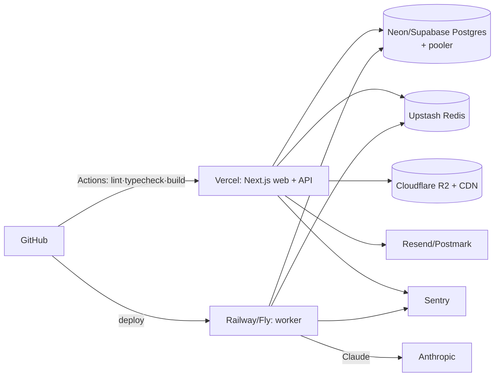

# 09 · Deployment Architecture

Managed PaaS / serverless — minimal DevOps, pay-as-you-go.



## Services

| Concern | Service | Notes |
|---|---|---|
| Web + API | **Vercel** | Per-PR preview deploys; edge CDN for marketing/static |
| Database | **Neon / Supabase** Postgres | Use the **pooled** endpoint at runtime (`DATABASE_URL`); `DIRECT_URL` for migrations |
| Cache / queue / rate-limit | **Upstash Redis** | BullMQ jobs; Upstash QStash optional for scheduled fan-out |
| Worker | **Railway / Fly.io** | Persistent Node process: consumers + cron |
| Media + CDN | **Cloudflare R2** | Signed URLs; object versioning enabled |
| Email | **Resend / Postmark** | Transactional |
| Errors / logs | **Sentry** + Axiom/Logtail | |

## Environments

`development` (local), `preview` (per-PR on Vercel), `production`. All config via env —
template in [`.env.example`](../.env.example). Secrets live in each platform's secret
manager; nothing secret is committed.

## CI/CD

[`.github/workflows/ci.yml`](../.github/workflows/ci.yml): Corepack → `pnpm install`
→ `prisma generate` → Prettier check → ESLint → typecheck → build. Deploys: Vercel
(web) and the worker host (Railway/Fly) on merge to `main`.

## Local development

```bash
pnpm install
docker compose up -d                 # Postgres + Redis
cp .env.example .env                 # fill values
pnpm --filter @ielts/db run migrate  # apply schema
pnpm dev                             # web + worker (turbo)
```

## Connection management (serverless)

Prisma connects through a pooler (Neon pooled endpoint / PgBouncer / Prisma Accelerate) so
many short-lived serverless invocations don't exhaust Postgres connections. The web app
**enqueues** jobs; the always-on worker **consumes** them.

## Scaling

Web scales statelessly on Vercel; the worker scales by adding replicas (BullMQ distributes
jobs). See [12-future-scalability.md](12-future-scalability.md). Backup/DR in
[14-backup-dr.md](14-backup-dr.md).
